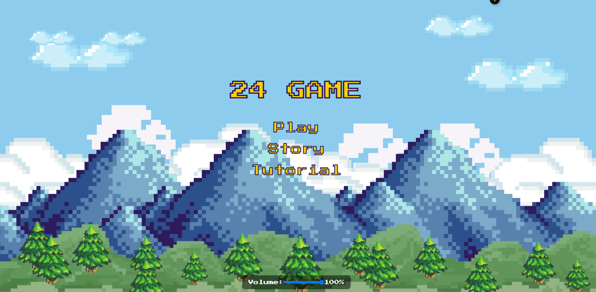
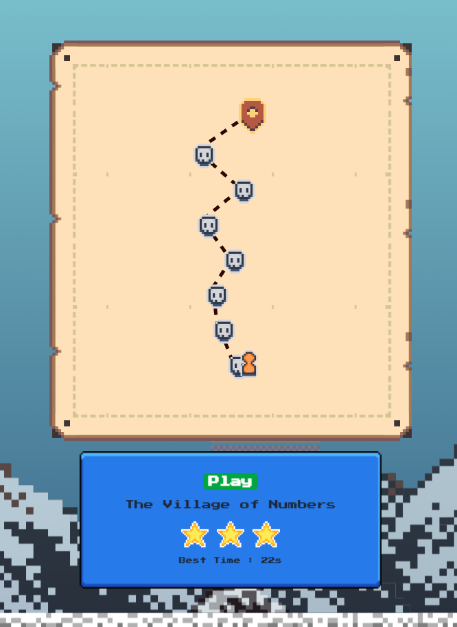
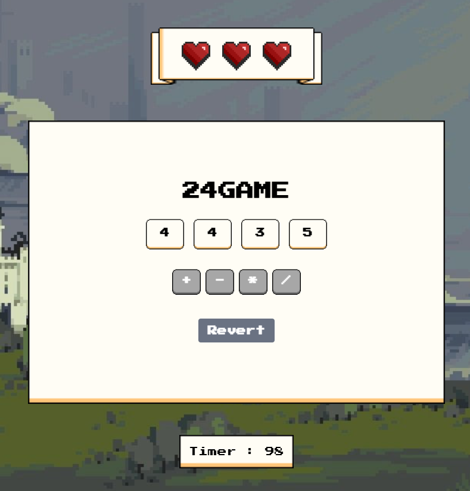
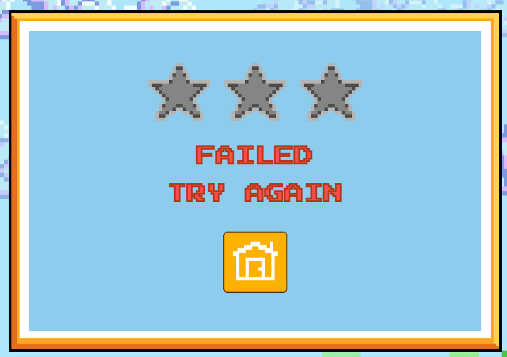
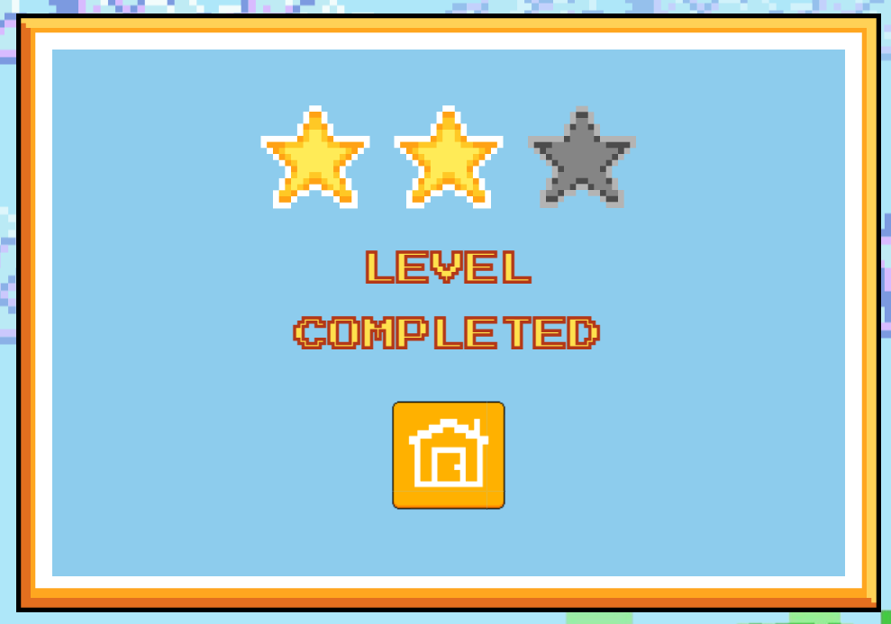
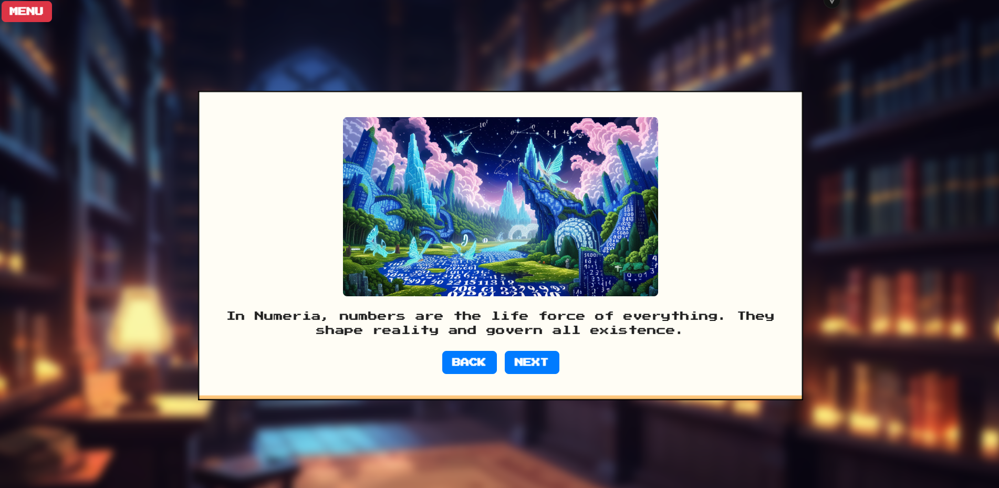
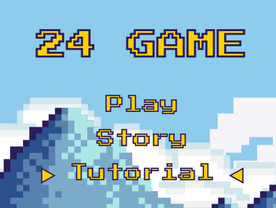
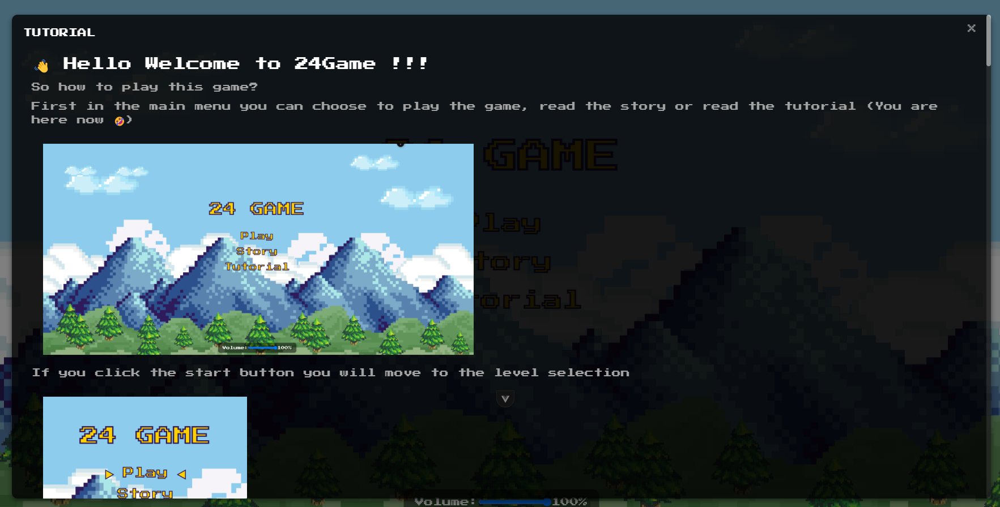
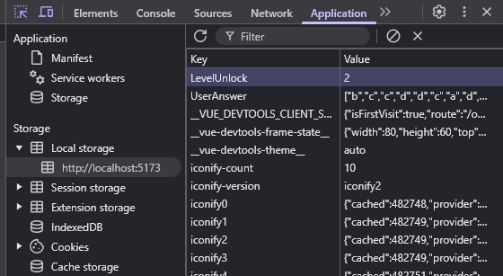
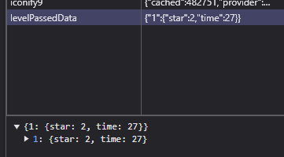

# 24Game

## Scope
เกม 24 คือเกมที่จะสุ่มเลขมา 4 ตัว และผู้เล่นจะต้องทำยังไงก็ได้ ให้เลขทั้ง 4 ตัวกลายเป็นเลข 24 ด้วยการ +, -, × หรือ ÷ นี่คือพื้นฐานของเกมเรา แต่ว่านอกเหนือจากนั้นแล้ว เรายังมีการวางถึงระบบต่างๆ เพิ่มเติม ดังนี้
- ระบบเนื้อเรื่อง อธิบายเล่าเรื่อง
- ระบบเลือกด่าน ตามเนื้อเรื่อง

## รายชื่อ
- 66130500004 ก้องภพ กองแสน
- 66130500012 จรณะ สุขโรจน์
- 66130500015 จิราพัชร สมพรรัตน์พันธ์
- 66130500024 ชิชา อัศวเสวี
- 66130500045 ธีรกานต์ ชูชาติ

## Flow
- ในการทำงานเราจะแบ่งแยก Branch กัน และเมื่อถึงเวลาที่จะต้องรวมผลเราจะใช้การ Pull Request และให้รหัส 012 เป็นผู้ตรวจสอบ และคอยแก้ Merge Conflict ต่างๆ (เนื่องจากเราใช้ไฟล์เดียว app.vue ดังนั้นจึงเกิดขึ้นอยู่บ่อยครั้ง)

## หน้าที่
- 004 [ 20 % ]
  - ดูแลเกมหลักการของตัวเกม 24 ( Logic และ ตัวเกมหลัก )
- 012 [ 20 % ]
  - ดูแลเรื่องการจัดการ Scene ( จัดการฉากหรือเมนูใดที่จะแสดงผล )
  - ดูแลในส่วนของการทำ Responsive สำหรับทุกหน้า
  - สนับสนุนฝ่ายที่ติดปัญหาและประสานโค้ดแต่ละส่วนเข้าด้วยกัน
  - นำเข้าภาพและข้อมูลต่างๆ
- 015 [ 20 % ]
  - ดูแลหน้าการเลือกด่าน
  - การออกแบบและกราฟฟิค
- 024 [ 20 % ]
  - ดูแล Main Menu
  - การออกแบบและกราฟฟิค
  - ดูแลหน้า result (เพิ่มเติมงานจาก consult)
  - ระบบหัวใจหน้าใน main game (เพิ่มเติมงานจาก consult)
- 045 [ 20 % ]
  - ดูแลระบบ Story
  - ดูแลระบบเสียงทั้งเกม
  - ดูแลระบบ Tutorial
  - และการจัดเก็บข้อมูล

## Update
| รหัส | สัปดาห์ที่ 2 | สัปดาห์ที่ 3 | สัปดาห์ที่ 4 | สัปดาห์ที่ 5 |
|------|---------|---------|---------|---------|
| 004  | - ออกแบบระบบการเล่นเกมและ Design หน้า Main game | - ทดสอบ function ของเกมจริงๆว่าตรงกับ Require ของทีมหรือไม่ | - แก้ไข function บางอย่างให้ตรงกับ Require ของทีม | เสร็จงานแล้ว |
| 012  | - ออกแบบระบบการเปลี่ยนหน้าและทดสอบ | - ทดสอบระบบการเปลี่ยนหน้ากับหน้าจริงๆ  -ทำระบบโยงเส้นในหน้าเลือกด่าน | - ทำ Responsive ให้กับหน้า Main Game - ปรับเปลี่ยน Design หน้า Main game ให้เหมาะกับการทำ Reponsive  | - ปรับเปลี่ยน Design ของ Main Game เพิ่มเติม  - เพิ่มระบบ Timer ให้ตัวเกม เพื่อใช้ต่อกับระบบคะแนน  - เชื่อมต่อระบบทุกหน้าเข้าด้วยกัน ให้ตัวเกมทำงานได้จริง   - ปรับเปลี่ยน Design หน้า Level ให้เหมาะกับการทำ Responsive  |
| 015  | -ออกแบบDesignหน้าLevelUp    -วางโครงสร้างStarsแต่ละดวง  |สร้างfunction rocket player โดยการทำให้มันขยับได้ทุกที่ที่กด | Update function rocket player ให้ไปแค่ตำแหน่งดาวที่กดเท่านั้น | -เพิ่มfunction ปุ่ม Showplay ให้แสดงแค่เวลาที่กดไปที่ดาวแต่ละดวง   -เพิ่มfunction selectLevel ให้แสดงLv1-8 บนดาว|
| 024  | - ออกแบบหน้า main menu | - ทำหน้า main menu |  - ทำหน้า main menu   - วางแผนระบบหัวใจเพิ่มเติม    - ออกแบบหน้า result | - ทำระบบหัวใจในหน้า main game   - ทำหน้า result |
| 045  | - ออกแบบ logic และหน้า story | - ทำหน้า story พร้อมทั้งระบบ next story | - แก้ไข path and next story method | - ทำระบบ check localStorage เพื่อสร้างเงื่อนไขในการแสดง story เมืื่อ unlocked |

## Features
- ตัวเกมของเราจะแบ่งออกเป็น 5 ส่วนหลักๆ
  - Main Menu
  - 
    - ส่วนนี้จะเป็นหน้าแรกของตัวเกม จะมี 3 ปุ่มที่เราสามารถกดได้
    - Start : ส่วนนี้จะพาเราไปยังหน้า Level Selection ซึ่งจะเป็นในส่วนอธิบายถัดไป
    - Story : ส่วนนี้จะพาเราไปยังหน้า Story ซึ่งจะเป็นในส่วนอธิบายถัดไป
    - Tutorial : ส่วนนี้จะเป็นการเปิดหน้าต่าง Tutorial เป็นส่วนของการสอนวิธีการเล่น
    - และมีส่วนล่างสุดเป็นส่วนของ Volume ใช้เพื่อปรับลดเสียงของเกม
  - Level Selection
  - 
    - ในหน้านี้จะเป็นการเลือก ด่าน ที่ผู้เล่นจะเข้าเล่น
      - *แต่ละด่านจะมีความต่างในเรื่องของเวลา ยิ่งด่านไกลเวลาก็ยิ่งน้อยลง*
    - โดยส่วนนี้ตัวแทนของผู้เล่นจะเป็น สัญลักษณ์ สีส้ม
    - ผู้เล่นสามารถเลือกด่านได้ด้วยการกดไปยังจุดนั้นๆ และตัวของผู้เล่นจะเคลื่อนย้ายไปยังจุดนั้นๆ
    - และเมื่อหยุดที่ด่านใด จะมึข้อมูล บันทึกการเล่น ที่ดีที่สุด อยู่ด้านล่าง (หากไม่มีแสดงว่ายังไม่เคยเล่นมาก่อน)
    - โดยผู้เล่นสามารถกด Play เพื่อเริ่มเล่นเกมได้เลย
  - Main Game
  - 
    - เกมหลักของเราคือ เกม 24 หลักการคือทำยังไงก็ได้ให้เลขทั้ง 4 ตัวรวมกันได้ 24
    - โดยเราจะสุ่มเลขใหม่ทุกครั้งในการเล่นมา 4 ตัว
    - โดยผู้เล่นจะต้องเลือก 2 ตัวเลขก่อนจากนั้นก็จะสามารถเลือก Operators ได้
      - ถ้าหากผู้เล่นคำนวณไปแล้ว รู้สึกไปต่อไม่ได้ หรือมันผิด สามารถกดปุ่ม Revert เพื่อย้อนกลับได้
      - ปุ่ม Revert จะใช้หัวใจ 1 หัวใจในการใช้งาน
    - สุดท้ายถ้าหากผู้เล่นสามารถทำเลข 24 ได้โดยใช้ตัวเลขทั้งหมด ผู้เล่นก็จะชนะและไปยังหน้า Result
      - แต่หากเวลาหมด หรือผู้เล่นเสียหัวใจทุกดวงและยังไม่สามารถทำเลข 24 ได้ผู้เล่นก็จะแพ้นั่นเอง
  - Result
    - หน้านี้จะเป็นหน้าการคำนวณผลและการแสดงผล
    - โดยหากผู้เล่นแพ้ ผู้เล่นจะไม่ได้ดาว และ จะไม่มีการบันทึกคะแนนใดๆ ลงไป
    - 
    - แต่หากผู้เล่นชนะ จะมีการนำ หัวใจที่เหลืออยู่ มาคำนวณ กับเวลาที่ใช้ไป
    - 
      - และให้เกณฑ์ออกมาเป็นดาว สูงสุด 3 ดาว
    - และหากแต้มที่ได้ หรือเวลาที่ได้ ทำได้ดีกว่ารอบก่อนหน้าที่มีการบันทึก ก็จะบันทึกเป็นแต้มใหม่ลงไปแทน
    - นอกจากนี้ทุกครั้งที่ชนะ 1 ด่าน ผู้เล่นจะปลดล็อคตัว Story ต่อ ให้สามารถไปติดตามต่อได้
  - Story
  - 
    - ส่วนนี้จะเป็นการเล่าเรื่องราวของเกม โดยจะมีภาพประกอบด้านบนและคำอธิบายด้านล่าง
    - ผู้เล่นสามารถกด Next หรือ Back เพื่อ ไปยังหน้าถัดไปและย้อนกลับได้
    - หากผู้เล่นยังไม่ปลดล็อคเนื้อเรื่องนั้นๆ จะมีการขึ้นเป็นรูปกุญแจว่ายังไม่สามารถอ่านได้ ต้องปลดล็อคก่อน

## Manual
- ส่วนนี้ผมขออนุญาติใส่เป็นในเกมนะครับ พอดีเราได้ทำส่วน Tutorial ไว้ จะเป็นส่วนแสดงวิธีการเล่นครับผม จะมีภาพประกอบด้วยน่าจะดูได้สะดวกว่าครับ
- 
- 
- ส่วนนี้ผมจะขอเป็นวิธีการข้ามด่านสำหรับการทดสอบเรื่องต่างๆ ครับผม
  - ด้วยความที่เราใช้ localStorage ในการเก็บข้อมูล ดังนั้น ถ้าหากอาจารย์ต้องการข้ามด่าน สามารถเข้าไปแก้ไขข้อมูลได้เลยครับผม
  - 
  - นอกเหนือจากส่วนนั้นแล้ว ก็ยังมีส่วนของ record แต่ละด่านว่า เราทำไว้เวลาเท่าไหร่ ได้ดาวเท่าไหร่ ส่วนนี้ก็สามารถปรับแก้ได้เช่นกันครับ
  - 
- **หลังจากการแก้จำเป็นต้อง Refresh หน้าเกม 1 รอบเพื่อให้ข้อมูลถูกโหลดขึ้นมาครับผม**

## Gameplay Video
### คลิกที่ Video ด้านล่างได้เลยครับ ❤️‍🔥!

## Reference
- รูปภาพ
  - https://humblepixel.itch.io/super-asset-bundle-5-mini-pocket-status
  - https://srtoasty.itch.io/ui-assets-pack-2
  - https://mounirtohami.itch.io/pixel-art-gui-elements
  - https://fliflifly.itch.io/hearts-and-health-bar
  - https://crusenho.itch.io/complete-ui-essential-pack
- เสียง
  - https://pixabay.com/music/synthwave-lady-of-the-80x27s-128379/
  - https://pixabay.com/sound-effects/button-click-289742/
  - https://pixabay.com/music/video-games-game-music-puzzle-strategy-arcade-technology-301226/
  - https://pixabay.com/music/video-games-so-happy-with-my-8-bit-game-301275/
  - https://leohpaz.itch.io/minifantasy-dungeon-sfx-pack
  - https://dagurasusk.itch.io/retrosounds
